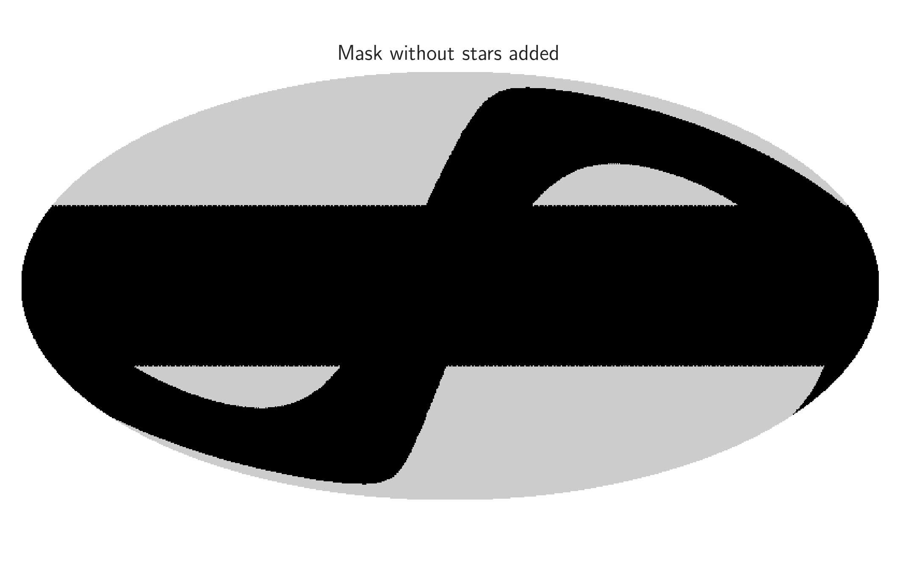
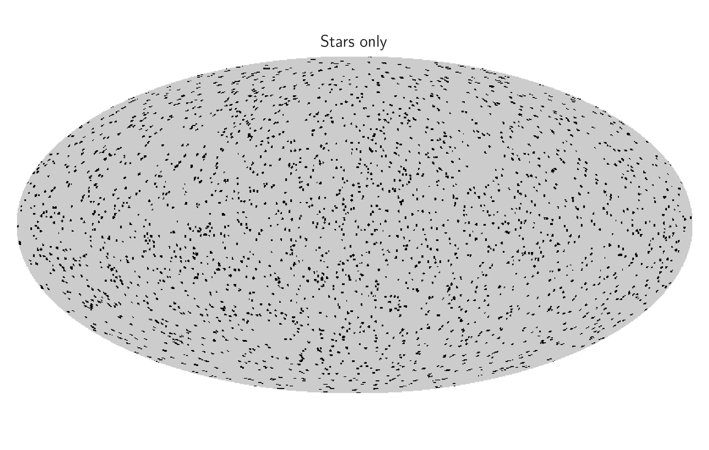
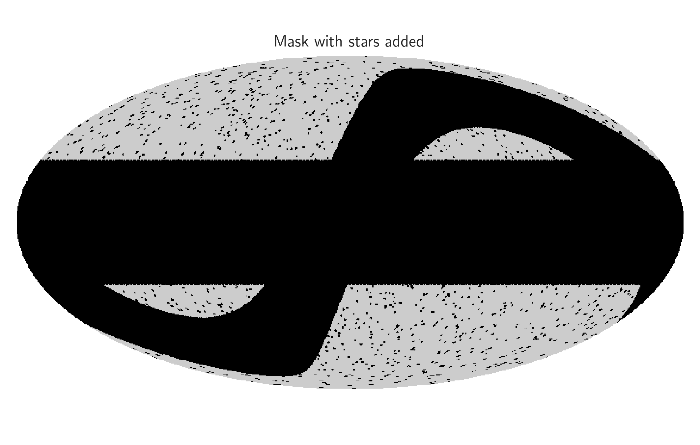

# Information about masks

This file contains information about how we generated our masks that we used in our analysis.

## Main galactic & ecliptic masks

The main galactic and ecliptic cuts that form my mask were generated using the line

```python
mask = generate_mask(3.25, n_side)
```

where we have set the parameter `theta = 3.25` here. This gives us an f<sub>sky</sub> value of
approximately 34.95%, which corresponds to a total value of unmasked pixels of `N_pix_mask = 274 890`.
The plot of this mask is as follows




## Star Mask

Here, our star mask was generated to roughly match the blinding star avoidance areas of the main Euclid telescope 
survey area ("Reference Survey Definition 2021A"), as described in 
[ArXiV:2108.01201.pdf](https://arxiv.org/pdf/2108.01201.pdf). We wanted to generate circular apertures that match the
expected average size of 0.785 deg<sup>2</sup>. This corresponds to an average radii of 30 arc minutes, assuming all
avoidance areas are circular. To add some randomness to our stellar mask, we uniformly sample the radii of these
avoidance areas between 25 and 35 arc minutes. Then to match the expected total sky area covered by the avoidance areas
of 635 square degrees within the existing sky mask, we generated our avoidance areas to cover an f<sub>sky</sub> of 
5% on the full sky.

The file "StarMask_N256.fits" was generated for the above values using the following command

```bash
./star_mask_generator 42 256 25 35 0.05 StarMask_N256.fits
```

The plot of the generated star mask is as follows



## Combined mask

We can now combine our main two cuts with our star mask to form a single mask that contains all physical effects
that are relevant to a weak lensing survey. This can be done by simply using Boolean AND logic on the masks, as the
resulting mask should only be True (i.e. allow observations in a given pixel) if both masks are True in that pixel.
Combining the masks in this way gives us the following mask



When we combine our masks in this way, we find that the resulting value for f<sub>sky</sub> is approximately 33.22%,
which corresponds to a total number of unmasked pixels of `N_pix_mask = 261 221`.
